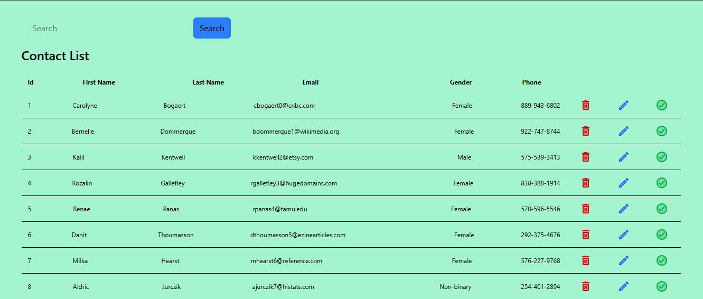
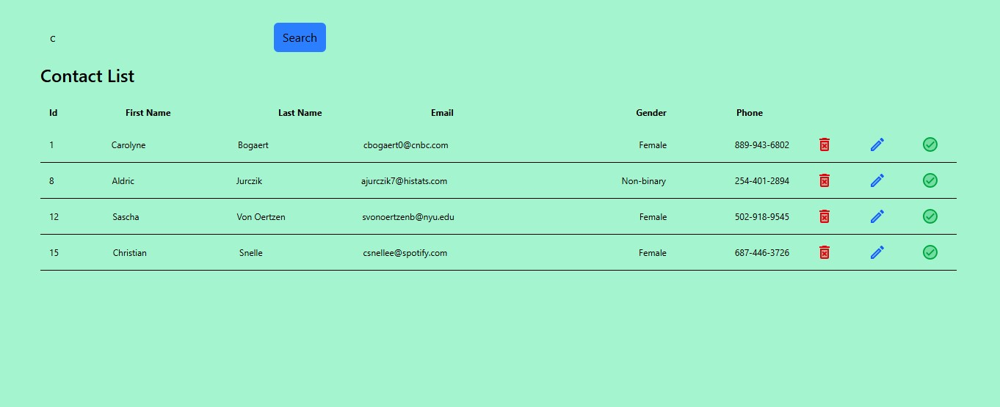
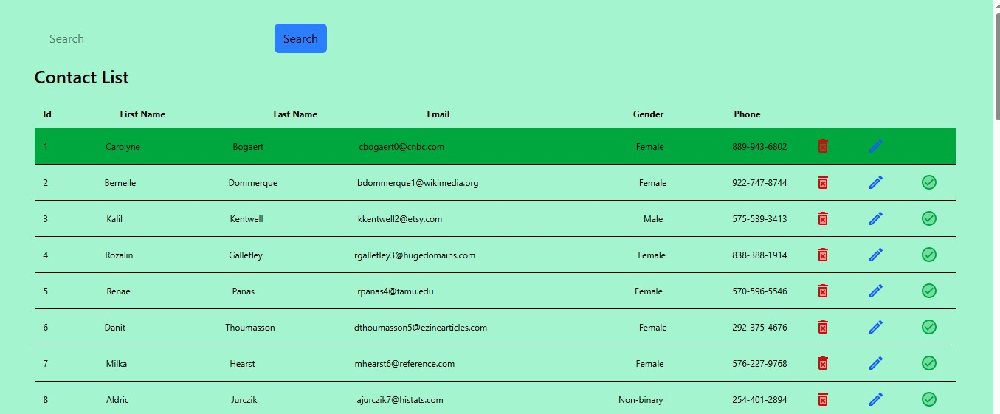
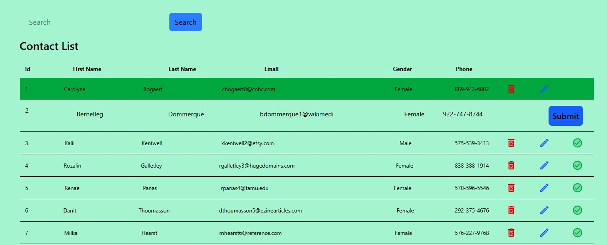

# Contact List Web App

A simple web application for managing a contact list built with React.js and styled using Tailwind CSS. This app allows users to perform CRUD (Create, Read, Update, Delete) operations on contacts and search through the list efficiently.

## Features

- **CRUD Operations**: Add, view, update, and delete contacts.
- **Search Functionality**: Easily search contacts by name.
- **State Management**: Uses React's `useState` hook to manage contact data.
- **Side Effects**: Uses React's `useEffect` hook to handle side effects like data fetching (if needed) or updating UI components.

## Technologies Used

- **React.js**: A JavaScript library for building user interfaces.
- **Tailwind CSS**: A utility-first CSS framework for creating custom designs quickly.
- **useState**: React hook to manage state within components.
- **useEffect**: React hook to perform side effects like fetching data or updating UI.

### Output

#### After Search

#### Status Update

#### Edit 

[Live Demo](https://a-contact-list.netlify.app/)

